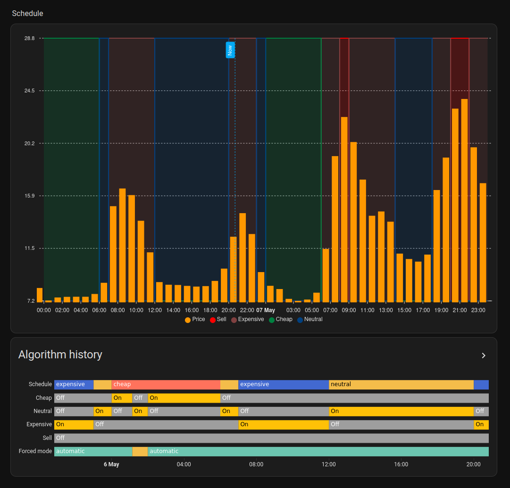

# node-red-contrib-energy-schedules

> This project is still work in progress!

A very advanced and flexible energy usage scheduler for Node-RED. It allows you to divide a day into different schedules 
depending on the energy price, which you can then use in your home automation setup to optimize your energy usage.

## Features

* flexible input format
  * takes price data in a simple input format, which allows you to ingest price data from any source, e.g. Nord Pool
  * price data is divided into _market time units_, not hours, meaning it works with e.g. 15 minute time units too
* advanced scheduling options
  * can be limited to a certain timespan during the day, e.g. 06-22
  * can select the _n_ cheapest or most expensive time units from the selected timespan, e.g. pick the 6 most expensive hours
  * supports optional _bounds_, meaning it can ignore time units that are deemed to cheap or too expensive
  * every schedule has a concept of _priority_, which is used to select the prevailing schedule when merging multiple overlapping schedules
  * can be both statically and dynamically configured
* signalers
  * on/off signaler
  * active schedule signaler

Here's an example of what can ultimately be accomplished:

